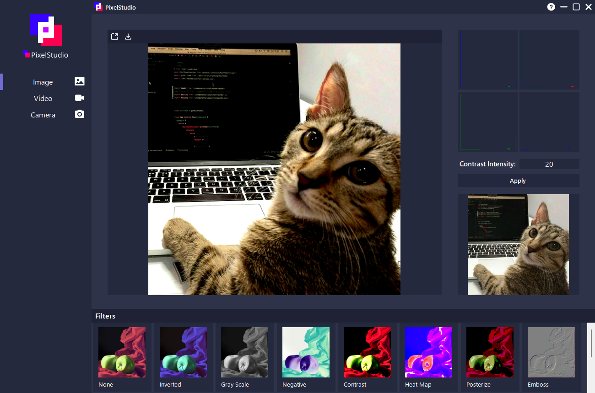
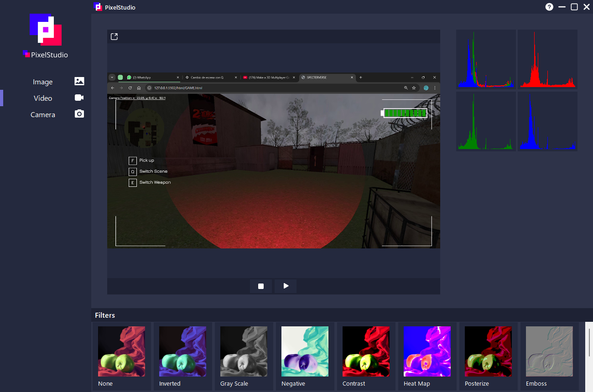
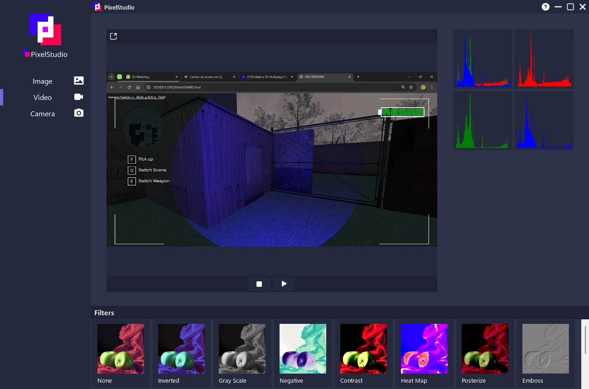
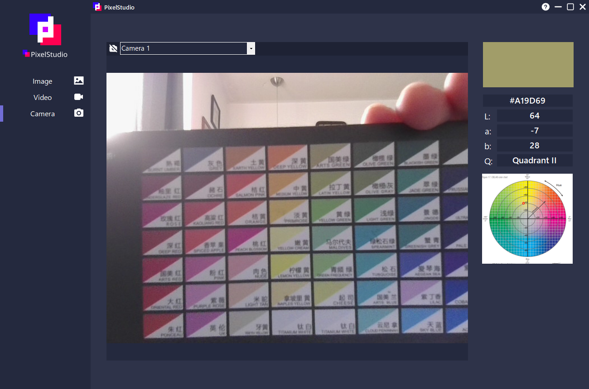

<h1 align="center">
  
  Pixel Studio
</h1>
<h3 align="center">An app for Video and Image processing</h3>

  

EmguCV | OpenCV Sharp

 

<h2>Image Editing</h2>

Edit images and videos using the filters listed at the bottom you can adjust the intesity and values for some of the filters for better results.

  
  

<h2>Video Editing</h2>

View hystogram changes in real-time. 

  
  

<h2>CieLab Color Identification</h2>

Identify any color on the CieLab color space in a single click.

  

 
<h2>Documentation & More</h2>
<h3 align="center"><i>
  <a href="https://github.com/anniehernandez/Pixel_Studio/blob/Annie_dev/PI_PixelStudio/Resources/PixelStudio_Documentation.pdf">See Documentation & User Manual</a>
</i></h3>

 

  
  
<i>Video: Image Processing - PixelStudio Walkthrough</i>

